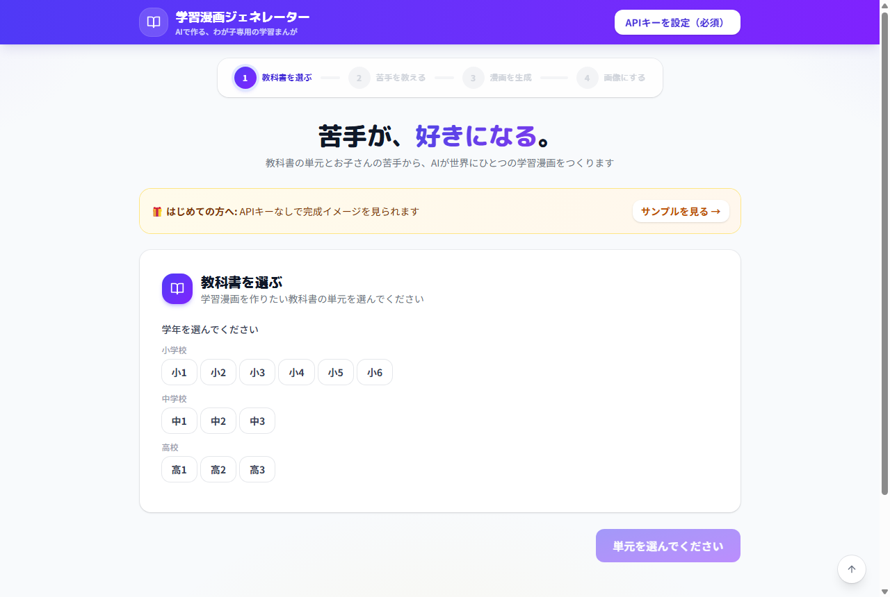
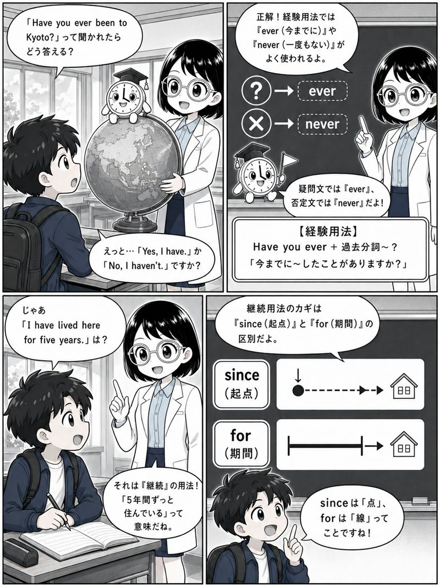

# 📚 学習漫画ジェネレーター

**苦手が、好きになる。** — 教科書の単元とお子さんの苦手を入力するだけで、AIがわが子専用の学習漫画をつくる無料Webアプリです。

[](LICENSE)
[](https://iruiru0605-coder.github.io/learning-manga-generator/)
[](https://react.dev/)

👉 **今すぐ使う（インストール不要）: https://iruiru0605-coder.github.io/learning-manga-generator/**

> ⭐ このプロジェクトが役に立ったら、ページ右上の「Star」ボタンで応援してください。開発の励みになります！



勉強が苦手なお子さんを持つ親御さんが、お子さんに合わせた学習漫画を手軽に作れることを目指しています。対象は**小学1年生〜高校3年生**の全教科です。

## ✨ 完成例（高校1年生・英語「完了形」）

このツールで台本・キャラクター・プロンプトを作り、ChatGPT（無料版でも可）で画像化した実例です。

| | |
|---|---|
|  |  |
|  |  |

## 🎯 特徴

- **かんたん4ステップ**: 学年・教科・教科書・単元を選び、苦手を入力するだけ（教科書がわからなくてもOK）
- **無料で始められる**: Gemini APIキー1本（無料枠あり）で台本も画像も生成できます
- **サンプル付き**: APIキーなしで「サンプルを見る」から完成イメージを確認できます
- **AIが漫画台本を生成**: 先生と生徒の対話形式で、楽しく学べる学習漫画（4/8/12ページ）を自動生成。セリフはその場で書き直せます
- **主人公をお子さんに**: 名前・性別・外見メモ・参考写真のアップロードで、主人公キャラクターをお子さんに似せられます
- **文字化けしない画像生成**: 標準モデルは吹き出しを空欄にしてセリフをアプリに表示。高品質モデル（Nano Banana Pro）なら日本語セリフ入りの画像も生成可能
- **1冊のPDFに**: 表紙+全ページ+セリフをまとめて印刷・PDF保存できます
- **自動保存**: 台本も生成画像もブラウザに保存され、リロードしても消えません
- **画像生成プロンプト付き**: 各ページの画像生成プロンプトをコピーしてChatGPT Image2やNanoBananaに貼り付けるだけ
- **格安**: DeepSeek V4を使えば1回の生成が約0.5円
- **プライバシー保護**: APIキーはブラウザにのみ保存され、外部に送信されません

## 🚀 いちばん簡単な使い方（インストール不要）

ブラウザで以下のURLを開くだけで、すぐに使えます。スマホ・タブレットでもOKです。

👉 **https://iruiru0605-coder.github.io/learning-manga-generator/**

### 💻 アプリのように使いたい場合（デスクトップにアイコンを置く）

毎回URLを入力しなくても、**アプリとしてインストール**できます。

1. 上のURLを **Chrome** または **Edge** で開きます
2. アドレスバーの右端にある「**インストール**」アイコン（小さなパソコンのマーク）をクリックします  
   （見つからない場合: Chromeは右上の「︙」→「キャストと共有とその他」→「ページをアプリとしてインストール」、Edgeは「…」→「アプリ」→「このサイトをアプリとしてインストール」）
3. 「インストール」を押すと、**デスクトップとスタートメニューにアプリアイコンが追加**されます
4. 次からは、そのアイコンをクリックするだけで専用ウィンドウでアプリが起動します

---

## 🖥️ パソコンの中で動かしたい場合（開発者・上級者向け）

通常は上のURLで使えるので、この手順は不要です。自分のパソコンの中だけで動かしたい方向けです。

> 💡 一度セットアップした後は、フォルダ内の **「アプリを起動.bat」をダブルクリックするだけ**で起動できます（ターミナル操作は不要になります）

### ステップ1: Node.js をインストールする

このアプリを動かすために必要なソフトです。すでに入っている場合はステップ2に進んでください。

1. 以下のURLをクリックして Node.js のダウンロードページを開きます  
   👉 **https://nodejs.org/ja/download**

2. 「LTS」と書かれた緑色のボタンをクリックしてダウンロードします  
   （LTS = 安定版という意味です。最新版ではなくこちらを選んでください）

3. ダウンロードしたファイルをダブルクリックして実行します

4. インストーラーが起動したら、**すべて「Next」で進み**、最後に「Install」をクリックします  
   （特に設定を変える必要はありません。そのままでOKです）

5. インストールが終わったら、パソコンを**再起動**します

### ステップ2: プロジェクトをダウンロードする

1. 以下の緑色の「Code」ボタンをクリックします  
   👉 **https://github.com/iruiru0605-coder/learning-manga-generator**

2. 「Download ZIP」をクリックしてファイルをダウンロードします

3. ダウンロードした ZIP ファイルを**右クリック → 「すべて展開」** で解凍します  
   展開先は**デスクトップ**がおすすめです

### ステップ3: アプリを起動する

#### Windows の場合

**かんたんな方法**: フォルダ内の **「アプリを起動.bat」をダブルクリック**するだけです。初回は自動でセットアップ（1〜2分）が走り、ブラウザが自動で開きます。2回目以降は数秒で起動します。

> ⚠️ **ダブルクリックすると黒い画面が一瞬出てすぐ閉じてしまう場合**: セキュリティソフト（ESET等）が bat の直接起動をブロックしている可能性があります。次のどれかで解決できます。
> 1. **ショートカットを作る（おすすめ）**: デスクトップで右クリック → 新規作成 → ショートカット → 場所に `cmd /k "C:\（展開したフォルダ）\learning-manga-generator\アプリを起動.bat"` と入力して作成。以後はそのショートカットから起動します（エラーが出ても画面が残るので原因も分かります）
> 2. セキュリティソフトの除外設定にこのフォルダを追加する
> 3. そもそもローカル起動を使わず、上の公開URL（インストール不要）を使う

うまくいかない場合は、以下の手動手順で起動できます。

1. デスクトップに展開された `learning-manga-generator` フォルダを開きます

2. フォルダ内の**何もないところ**で **Shift キーを押しながら右クリック** します

3. メニューから **「PowerShell ウィンドウをここで開く」** または **「ターミナルで開く」** を選択します

4. 黒い画面が開いたら、以下のコマンドを**1行ずつ**入力して Enter キーを押します：

```bash
npm install
```

（これには1〜2分かかります。何やら文字が流れますが、赤いエラーが出なければ大丈夫です）

```bash
npm run dev
```

5. 以下のような表示が出れば起動成功です：
   ```
   ➜  Local:   http://localhost:5173/
   ```

6. ブラウザ（Chrome や Edge）を開いて、アドレスバーに **http://localhost:5173/** と入力して Enter を押します

7. 学習漫画ジェネレーターの画面が表示されれば完了です！

#### Mac の場合

1. デスクトップに展開された `learning-manga-generator` フォルダを開きます

2. **command キーを押しながらスペースキー**を押して Spotlight を開きます

3. 「**ターミナル**」と入力して Enter を押します

4. ターミナルに以下のコマンドを入力して Enter：
   ```bash
   cd ~/Desktop/learning-manga-generator
   ```

5. 続けて以下のコマンドを**1行ずつ**入力して Enter キーを押します：

```bash
npm install
```

（これには1〜2分かかります）

```bash
npm run dev
```

6. 以下のような表示が出れば起動成功です：
   ```
   ➜  Local:   http://localhost:5173/
   ```

7. ブラウザ（Safari や Chrome）を開いて、アドレスバーに **http://localhost:5173/** と入力して Enter を押します

8. 学習漫画ジェネレーターの画面が表示されれば完了です！

### ステップ4: API キーを取得する

このアプリはAIに漫画の台本を作ってもらうために「APIキー」という合言葉が必要です。

> 💡 **いちばん簡単なのは Gemini キー1本で始める方法です（無料枠あり）。**
> 👉 https://aistudio.google.com/apikey でキーを取得し、アプリ右上の「APIキーを設定」でプロバイダーに「Gemini」を選んで貼り付けるだけ。台本も画像も同じキーで生成できます。

たくさん使う場合は DeepSeek が一番安く使えます（以下の手順）。

1. 👉 **https://platform.deepseek.com/** を開きます

2. 右上の「Sign Up」からアカウントを作成します（メールアドレスまたはGoogleアカウントで登録できます）

3. ログイン後、左メニューの「**API Keys**」をクリックします

4. 「**Create API Key**」ボタンをクリックします

5. 表示されたキー（`sk-` ではじまる長い文字列）を**コピー**します  
   ⚠️ このキーはパスワードのようなものです。誰にも教えないでください

6. 左メニューの「**Top up**」から残高をチャージします  
   💰 学習漫画1回の生成は約0.5円なので、最低額のチャージで十分長く使えます

7. 学習漫画ジェネレーターの画面右上の「**APIキーを設定**」ボタンをクリックします

8. コピーしたキーを貼り付けて閉じます

🎉 **これで準備完了です！** あとは画面上の手順に従って教科書を選び、苦手を入力してください。

> ⚠️ 生成時に「**Insufficient Balance（残高不足）**」というエラーが出た場合は、アカウントにチャージ残高がない状態です。上記ステップ6のチャージを行ってください。

---

## 🚀 使い方

### 1. APIキーを設定する
右上の「API設定」ボタンからAPIキーを入力します。DeepSeek V4がおすすめです（最も安価）。
- [DeepSeek APIキーを取得](https://platform.deepseek.com/)

### 2. 教科書を選ぶ
学年 → 教科 → 教科書 → 単元の順に選択します。

### 3. 苦手を入力する
AIが「どこが苦手ですか？」と質問するので、つまずいているポイントを自由に入力します。

### 4. 漫画台本を確認する
AIが生成した8ページの台本を確認します。

### 5. 画像を生成する（2つの方法）

**方法A: ツール内で一括生成（Gemini APIキーが必要）**
設定画面で画像生成モデルを選べます。
- 標準（Nano Banana・約6円/枚）: 吹き出しは空欄で生成し、セリフはアプリの「セリフ一覧」に表示
- 高品質（Nano Banana Pro・約20円/枚）: 日本語のセリフをそのまま画像に描き込み

**方法B: プロンプトをコピーして外部ツールで生成（節約モード）**
各ページのプロンプトをChatGPT（無料枠でも可）やNanoBananaに貼り付けて画像を生成します。

#### 方法Bでキャラクターを統一するコツ

1. **先にキャラクター画像を用意する**
   - Gemini APIキーがある場合: ツール内の「キャラクター参照画像」で生成して「全キャラを保存」
   - ない場合: 各キャラクターの「プロンプトをコピー」をChatGPT等に貼り付けて生成し、画像を保存
2. **ページを生成するたびに、キャラクター画像（2〜3枚）をチャットに添付**してから、ページのプロンプトを貼り付ける（「添付した画像のキャラクターで描いて」と一言添えると確実）
3. できるだけ**同じチャット内で続けて生成**すると、絵柄とキャラクターが安定する
4. コピーしたプロンプトの末尾には日本語セリフの描き込み指定（`CRITICAL TEXT RULE` 以下）が含まれています。文字が化けるツールではその部分を削除して空欄の吹き出しで生成し、アプリの「セリフ一覧」を添えてください
5. **ChatGPTは無料版でもOK**です（画像生成は1日2〜3枚が目安）。4ページ漫画なら約2日、8ページなら3〜4日で**完全無料**で完成します。「毎日2ページずつ読み進める連載」のような楽しみ方もおすすめ。急ぐ場合は ChatGPT Plus / Gemini API をご利用ください

## 💻 開発者向け

```bash
# インストール
npm install

# 開発サーバー起動
npm run dev

# ビルド
npm run build
```

## 📊 コスト比較（8ページ漫画1回の生成）

| プロバイダー | モデル | 推定コスト |
|---|---|---|
| DeepSeek | deepseek-chat | ~$0.0035 (約0.5円) |
| OpenAI | gpt-4o-mini | ~$0.0008 (約0.1円) |
| Anthropic | claude-haiku-4-5 | ~$0.0015 (約0.2円) |

画像生成はChatGPT Image2（ChatGPT Plusに含まれる）やNanoBanana（無料）を利用するため、追加費用はかかりません。

## 🛠 技術スタック

- React 19 + TypeScript + Vite
- Zustand（状態管理）
- Tailwind CSS v4

### 対応AIプロバイダー
- DeepSeek V4（推奨・最安価）
- OpenAI（GPT-4o mini 等）
- Anthropic（Claude Haiku 等）

## 📄 ライセンス

MIT License

## 🙏 クレジット

教科書データは[教科書LOD](https://w3id.org/jp-textbook/)（CC BY 4.0）および[学習指導要領LOD](https://w3id.org/jp-cos/)を参考にしています。
